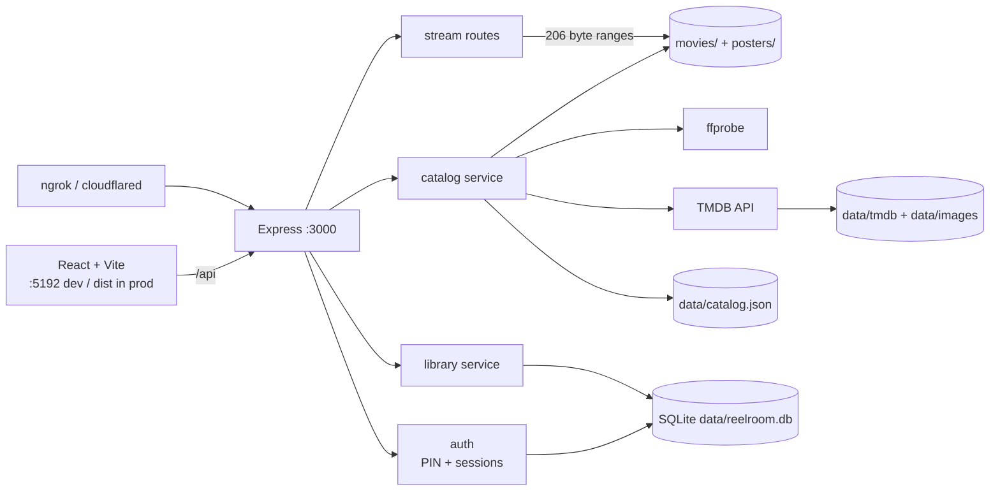

# CLAUDE.md

Guidance for Claude Code when working in this repository.

## What this is

Reelroom is a private streaming app for the owner's own movie files, served from one machine and
exposed to a handful of people over an **ngrok or cloudflared tunnel**. It is deliberately shaped
like a production streaming site (hero carousel, faceted browse, custom player, per-profile watch
state) while having no runtime dependency beyond an optional TMDB metadata fetch.

**The core principle a change must not violate:** this app is publicly reachable whenever a tunnel is
up. The PIN gate covers *everything* — the catalog, posters, downloads, and `/api/stream` itself. Do
not add a route outside `requireAuth`, and do not make an endpoint "just for convenience" public.
`/api/health` and `/api/auth/*` are the only intentional exceptions.

## Architecture

Two apps, one origin. In production the API serves the built frontend from `frontend/dist`; in
development Vite proxies `/api` and `/posters` to the API.

- **API** — `:3000` (`backend/`)
- **Vite dev server** — `:5192` (`frontend/`); override the proxy target with `API_PORT=<port>`



The **catalog is in-memory**, rebuilt from disk on boot and snapshotted to `data/catalog.json`.
**SQLite holds only per-person state**: profiles, sessions, progress, watchlist, favourites, player
preferences. Sequence diagram for the playback/resume flow is in `README.md`.

## Running it

The two apps install and run independently, but share **one `.env` at the project root** — there is
no `backend/.env`. `config.js` resolves the root itself, so the backend works from any cwd.

```bash
cd backend  && npm install && npm run dev    # API on :3000, node --watch
cd frontend && npm install && npm run dev    # Vite on :5192, proxies /api to :3000
```

The backend serves `frontend/dist` when it exists, so the UI dev server is optional. Tunnel :3000,
never :5192.

Root shortcuts wrap the same things:

```bash
npm run setup          # installs backend + frontend
npm run serve          # build UI, then serve everything from :3000
npm run dev:api        # cd backend && npm run dev
npm run dev:ui         # cd frontend && npm run dev
npm run rescan         # force a full re-probe + TMDB re-fetch
npm run typecheck      # tsc --noEmit; must pass before any commit
```

Never start a dev server with a raw background shell command — use the launch config in
`.claude/launch.json` (`reelroom-api`, `reelroom-ui`) so logs stay readable.

## Layout

```text
backend/src/
  routes/      HTTP only — parse, call a service, serialize. No business logic.
  services/    catalog, tmdb, media (ffprobe), library, auth, serialize
  middleware/  auth guard, error handler
  db/          connection + append-only migrations
frontend/src/
  pages/       Home, Browse, Detail, Watch, ListPage, Login
  components/  Navbar, HeroCarousel, MovieRail, PosterCard, FilterSidebar, player/
  store/       zustand: session, toasts
  api.ts       the single typed API client — all fetches go through here
legacy/        the original single-file server + static pages. Reference only; do not extend.
data/          generated: SQLite, TMDB cache, catalog snapshot. Safe to delete.
```

Layering is one-directional: `routes → services → db`. Routes never touch SQLite directly; services
never touch `req`/`res`.

## Conventions

- **Backend is ESM JavaScript, not TypeScript.** Don't convert it piecemeal.
- **Frontend is TypeScript strict** with `noUncheckedIndexedAccess`. No `any` to silence an error —
  type it or narrow it. `npm run typecheck` is the gate.
- Config comes from `backend/src/config.js` (zod-validated) — never read `process.env` elsewhere.
- Log with pino and structured fields: `logger.info({ count }, "catalog.scanned")`, not f-strings.
  Event names are `noun.verb_past`.
- Two response shapes: `toCardMovie` for grids/rails, `toPublicMovie` for detail. Both strip the
  server-only `technical`/`tmdb`/`sortTitle` fields — add new internal fields to `INTERNAL` in
  `services/serialize.js`.
- Filters live in the URL, not component state, so every browse view is shareable.

## Gotchas

Each of these cost real debugging time. Don't rediscover them.

- **Migrations run at import time.** `db/index.js` calls `migrate()` at module load, *not* from
  `main()`. Services build prepared statements at import time too, and ESM evaluates those before any
  function body runs — moving `migrate()` into `main()` throws `no such table: profiles` at startup.
- **`movies.json` file matching is case-insensitive.** macOS is case-preserving but not
  case-sensitive: an entry written `maareesan.mp4` must still match `Maareesan.mp4` on disk. A raw
  string compare makes the override silently do nothing, which looks like "TMDB is wrong" rather than
  a bug.
- **`navigator.sendBeacon` can only POST.** `/api/library/progress/:id` is registered for both PUT
  *and* POST for exactly that reason — the beacon is what saves the position when a tab closes
  mid-film. Don't "tidy up" the duplicate route.
- **Never gzip the video routes.** `compression` is filtered to skip `/api/stream` and
  `/api/download`. Compressing an already-compressed 2 GB file burns CPU for zero gain.
- **Streaming is exempt from the rate limiter.** Seeking fires many small ranged requests; rate
  limiting them stalls playback.
- **`secure` cookies and NODE_ENV.** With `NODE_ENV=production` the session cookie is secure-only —
  correct over the https tunnel, but sign-in silently fails over plain `http://localhost:3000`. Use
  `development` for local work.
- **`.mkv` and `.avi` don't play in browsers.** They're catalogued and downloadable; `playableInBrowser`
  drives the player's explanatory message. Don't "fix" this by hiding them.
- **TMDB issues two different credentials.** `themoviedb.org/settings/api` shows a v3 API key (32 hex
  chars, sent as `?api_key=`) *and* a v4 Read Access Token (a JWT starting `eyJ`, sent as
  `Authorization: Bearer`). `services/tmdb.js` sniffs which one it was given and picks the right
  transport — the v4 token 401s against the query-param form, and the only visible symptom is
  "all metadata is missing". A 401 is now logged loudly; keep it that way.
- **The catalog snapshot is a cache, not truth.** When enrichment looks stale or wrong, delete
  `data/catalog.json` or run `npm run rescan` before debugging the scanner.
- **TMDB images are proxied, never hot-linked.** `/api/img/:size/:path` caches to `data/images`, so
  the app works offline after first load and viewers' IPs never reach TMDB's CDN.
- **Search covers the synopsis.** `matchesQuery` in `routes/movies.js` includes `description`;
  dropping it makes obvious searches return nothing on a small library.

## Secrets

`REELROOM_PIN` and `SESSION_SECRET` live in `.env` (gitignored). `.env.example` is committed and must
only ever hold placeholders. The server refuses to boot with `NODE_ENV=production` while the PIN is
still the default `1234`, or with no `SESSION_SECRET` — keep both guards.
