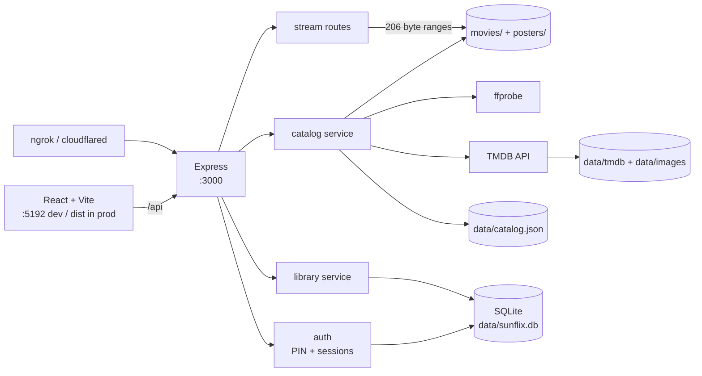
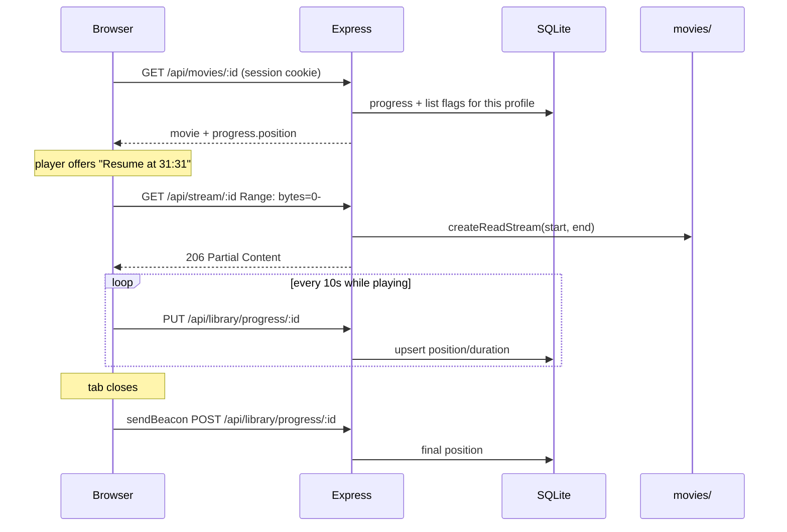

# SunFlix

A private streaming app for your own movie files. Drop videos into `movies/`, and SunFlix reads
them, enriches them from TMDB, and serves a modern browsing-and-playback experience — behind a PIN,
so it stays yours even when you expose it through ngrok or cloudflared.

Built to be *shaped* like a production streaming site (hero carousel, faceted browse, custom player,
per-profile watch state) while running entirely on one machine.

## Stack

| Layer | Choice |
|---|---|
| API | Node 20+, Express 4, ESM |
| Data | SQLite via `better-sqlite3` (WAL), append-only migrations |
| Media | HTTP range streaming; `ffprobe` for duration/resolution/audio |
| Metadata | TMDB v3, cached to disk (JSON + images) |
| Auth | Shared room PIN → hashed session token in an httpOnly cookie |
| UI | React 18 + TypeScript (strict) + Vite + Tailwind + react-router + zustand |
| Hardening | helmet CSP, rate limiting, compression, `pino` structured logs |

## Architecture



The catalog lives in memory, rebuilt from disk on boot and snapshotted to `data/catalog.json` so
restarts are instant. SQLite holds only what is per-person: profiles, sessions, watch progress,
watchlist, favourites, player preferences.

### Playback and resume



## Setup

### Prerequisites

- **Node 20+** (`node -v`)
- **ffmpeg**, which provides `ffprobe` — `brew install ffmpeg`. Optional but strongly recommended:
  without it you lose real durations, resolution and the quality badges.

### Step 0 — shared config (do this once, before either app)

Both apps read the **same `.env` at the project root**. There is no `backend/.env` or
`frontend/.env` — the backend resolves the root path itself, so it works no matter which directory
you launch it from.

```bash
cp .env.example .env
```

Edit `.env` and set:

| Key | Notes |
|---|---|
| `SUNFLIX_PIN` | The Room PIN on the login screen. Change it before tunnelling. |
| `SESSION_SECRET` | `openssl rand -hex 32`. Rotating it signs everyone out. |
| `TMDB_API_KEY` | Optional but recommended — see [Where each field comes from](#where-each-field-comes-from). |

### Backend (API, port 3000)

```bash
cd backend
```

```bash
npm install
```

```bash
npm run dev
```

`npm run dev` uses `node --watch` and restarts on save. For production, `npm start` instead.

Verify it on its own, without the UI:

```bash
curl -s http://localhost:3000/api/health
```

You should get `status: ok`, a catalog count, and whether TMDB is enabled. `PORT=3011 npm run dev`
moves it if 3000 is taken.

The backend is **self-sufficient**: it scans your films, serves the API, and — if `frontend/dist`
exists — serves the built UI too. You do not need the frontend dev server running to use the app.

### Frontend (UI, port 5192)

```bash
cd frontend
```

```bash
npm install
```

```bash
npm run dev
```

Open **http://localhost:5192**. Vite proxies `/api` and `/posters` to the backend on **:3000**, so
the backend must already be running or every request 502s.

If you moved the backend port, point the proxy at it:

```bash
API_PORT=3011 npm run dev
```

Other frontend commands:

```bash
npm run typecheck    # tsc --noEmit — the gate; must pass
```

```bash
npm run build        # emits frontend/dist, which the backend then serves
```

### Which mode do I want?

|  | Two servers (dev) | One server (production-style) |
|---|---|---|
| Commands | `backend: npm run dev` + `frontend: npm run dev` | `npm run build` in `frontend/`, then `npm start` in `backend/` |
| Open | http://localhost:5192 | http://localhost:3000 |
| Hot reload | yes | no — rebuild to see changes |
| **Use this for tunnelling** | no | **yes** — tunnel :3000 |

### Root shortcuts

From the project root, these just wrap the per-app commands above:

```bash
npm run setup      # npm install in both
```

```bash
npm run serve      # build the UI, then start the API on :3000
```

```bash
npm run dev:api    # same as: cd backend && npm run dev
```

```bash
npm run dev:ui     # same as: cd frontend && npm run dev
```

**Docker** (builds both, one container, :3000):

```bash
docker compose up --build
```

## Exposing it over a tunnel

> **Tunnel port 3000, not 5192.** 3000 is the backend serving the built UI. 5192 is the Vite dev
> server — see [Blocked request](#blocked-request-this-host-is-not-allowed) below for what happens if
> you point a tunnel at it.

Start the app on :3000 first (`npm run serve`), then put a tunnel in front of it. Either tool works;
both terminate TLS for you, which is why `TRUST_PROXY=true` is the default.

**cloudflared** — free, no account needed for a quick share:

```bash
cloudflared tunnel --url http://localhost:3000
```

It prints a `https://<random-words>.trycloudflare.com` URL. That address is ephemeral — it changes
every restart. Install it with `brew install cloudflared`.

For a URL that survives restarts, you need a Cloudflare account and a domain on it:

```bash
cloudflared tunnel login
```

```bash
cloudflared tunnel create sunflix
```

```bash
cloudflared tunnel route dns sunflix sunflix.yourdomain.com
```

```bash
cloudflared tunnel run --url http://localhost:3000 sunflix
```

**ngrok** — same idea:

```bash
ngrok http 3000
```

### Before you share the link

1. **Change `SUNFLIX_PIN` in `.env`** and restart. The default `1234` is for local testing only.
2. Keep `NODE_ENV=development` unless you have a reason to switch — in `production` the session
   cookie becomes secure-only, which is correct over the https tunnel but breaks sign-in over plain
   `http://localhost:3000`.
3. Your **upload bandwidth is the bottleneck**, not this server. There's no transcoding, so a 1080p
   file streams at its full bitrate to every viewer at once.

The PIN gate covers everything including `/api/stream`, `/api/download` and `/posters`, so a leaked
tunnel URL alone gets nobody in. Sign-in is rate-limited to 10 attempts per 15 minutes per IP.

### "Blocked request. This host is not allowed."

```
Blocked request. This host ("xyz.trycloudflare.com") is not allowed.
To allow this host, add "xyz.trycloudflare.com" to `server.allowedHosts` in vite.config.js.
```

That message comes from **Vite**, which means the tunnel is pointed at **:5192** rather than **:3000**.
Vite 5.4.12+ rejects unrecognised `Host` headers to block DNS rebinding, so a tunnel hostname is
refused. It can appear "suddenly" on a setup that used to work — the trigger is Vite being upgraded,
not anything about the tunnel.

**The fix is to tunnel the right port:**

```bash
npm run serve
```

```bash
cloudflared tunnel --url http://localhost:3000
```

That serves the built, minified UI from the backend — which is what you want in front of other people
anyway: no source maps of your code, no HMR websocket, and faster.

**If you deliberately want to share a hot-reloading dev session**, `vite.config.ts` already allows the
cloudflared and ngrok domains, so you only need to tell HMR it is behind https:

```bash
TUNNEL=1 npm run dev
```

Without `TUNNEL=1` the page reload-loops, because the browser tries `ws://<tunnel-host>:5192` for HMR.
The allowlist is scoped to tunnel providers rather than set to `true`, so the rebinding protection
still applies to every other host.

## Adding films

Drop a video into `movies/`. That is the whole required step — the filename is parsed for title and
year (`Movie.Name.2019.1080p.BluRay.mp4` works), `ffprobe` reads the real duration, resolution and
audio tracks, and TMDB fills in rating, synopsis, genres, cast, backdrop and trailer.

The catalog refreshes on every boot. To force a full re-fetch:

```bash
npm run rescan
```

`movies.json` is optional and purely an **override** layer, matched to a file by `file` (case
insensitive):

```json
[
  {
    "file": "maareesan.mp4",
    "id": "1",
    "title": "Maareesan",
    "year": 2025,
    "genre": ["Thriller", "Drama"],
    "description": "…",
    "poster": "maareesan.webp",
    "category": "Tamil",
    "tmdbId": 1234567
  }
]
```

Every field is optional. `id` sets the URL slug (omit it and one is derived from the title).
`"tmdb": false` opts a title out of enrichment entirely; `tmdbId` pins a specific match when the
title search guesses wrong.

## Storage

Media lives behind a storage adapter, so moving from a folder to a bucket is config, not a rewrite.
The catalog scanner, ffprobe, the streaming route and the import watcher all talk to the same
interface.

**Local (default)** — reads `MOVIES_DIR`:

```bash
STORAGE_DRIVER=local
```

**S3-compatible** — AWS S3, Cloudflare R2, MinIO or Backblaze B2. Install the SDK first:

```bash
npm --prefix backend install @aws-sdk/client-s3 @aws-sdk/s3-request-presigner
```

Then set `STORAGE_DRIVER=s3`, `S3_BUCKET`, credentials, and `S3_ENDPOINT` for anything that isn't
AWS. ffprobe reads a presigned URL and range-requests only the header, so scanning doesn't download
your library.

By default the app proxies video bytes from the bucket, which keeps the PIN gate in front of every
request. Setting `S3_SIGNED_URLS=true` instead redirects the player straight to a presigned URL —
much cheaper, but that URL then works for anyone holding it until it expires.

| | Local | S3 |
|---|---|---|
| New files detected by | filesystem events | polling (`WATCH_POLL_SECONDS`) |
| Bytes served by | this app | this app, or a presigned redirect |
| Needs the AWS SDK | no | yes |

## Auto-import

New files are picked up without a restart — drop one in and it appears. Because a copy fires an
event the moment the file appears, the watcher waits for the size to stop changing
(`WATCH_STABLE_SECONDS`, default 8s) before probing, so a half-copied 2 GB file never gets imported
with a nonsense duration. Deletions are noticed too. Set `WATCH_ENABLED=false` to turn it off.

## Requests

`/requests` is a shared board — anyone signed in can ask for a film, vote on somebody else's
request, and withdraw their own. Admins can mark one added or declined.

Requests close themselves: when the watcher imports a file whose title matches an open request, it
is marked fulfilled and linked to the new film, so nobody has to tick it off manually.

## Admin

`/admin` is visible only to admins and covers library health (size, films missing artwork, films
with no TMDB match, files that won't play in a browser), scan controls, storage and auto-import
status, profile management, and active sessions with per-session revoke.

The first profile to sign in becomes the admin. If that isn't the right person, promote someone from
the host machine:

```bash
npm --prefix backend run make-admin -- <profile name>
```

Run it with no name to list profiles and see who is currently an admin.

Fixing a wrong TMDB match writes into `movies.json` rather than a hidden table, so the admin panel
and a text editor never disagree about the truth.

## Where each field comes from

Three sources, in strict priority order: **`movies.json` → TMDB → the file itself**. Anything you set
by hand always wins.

| Field | Source | Notes |
|---|---|---|
| Title, year | filename, or `movies.json` | `Movie.Name.2019.1080p.BluRay.mp4` → `Movie Name` + `2019` |
| **Rating** (⭐ 0–10) | TMDB `vote_average` | Needs `TMDB_API_KEY`. Blank without it. |
| Synopsis, tagline | TMDB `overview` | |
| **Genres** | TMDB | Drives the genre filter and the homepage genre rails |
| **Category** (Hollywood / Tamil / …) | derived from TMDB `original_language` | See below |
| Cast + headshots, director, writers | TMDB `credits` | |
| Backdrop, trailer | TMDB `images` / `videos` | Trailer is a YouTube embed |
| Certification (U/A, PG-13…) | TMDB `release_dates` | |
| Poster | `posters/` if present, else TMDB | Local artwork **wins** over TMDB |
| **Duration, resolution, quality badge** | `ffprobe`, reading the actual file | Never trusts a hand-typed runtime |
| Audio tracks, codec, file size | `ffprobe` + `stat` | Shown in the detail page's File panel |

**Category** is not a TMDB field — it's mapped from the film's original language in
`LANGUAGE_CATEGORY` (`backend/src/services/catalog.js`): `en → Hollywood`, `hi → Bollywood`,
`ta → Tamil`, `ml → Malayalam`, `te → Telugu`, `ko → Korean`, and so on. Anything unmapped becomes
`World`; with no TMDB data at all it shows `Uncategorised`. Override it per film with `"category"` in
`movies.json`, or add a language to that map.

**To enable TMDB**: put a free key from https://www.themoviedb.org/settings/api into `TMDB_API_KEY` in
`.env`, restart, then `npm run rescan`. Responses are cached to `data/tmdb/` for 30 days and images
to `data/images/`, so it works offline afterwards. Without a key the app runs fine — you just get
titles, durations and quality badges and nothing else.

**If TMDB matches the wrong film**, set `"tmdbId"` in `movies.json` to the number in the TMDB URL
(`themoviedb.org/movie/**1234567**-title`), or `"searchTitle"` to give the search a cleaner string,
then rescan. `"tmdb": false` opts a title out entirely.

**Subtitles**: put a `.vtt` or `.srt` next to the video with the same base name — `Maareesan.mp4` +
`Maareesan.en.srt`. SRT is converted to WebVTT on the fly.

## Layout

```text
backend/src/
  routes/      HTTP only — parse, call a service, serialize
  services/    catalog, tmdb, media (ffprobe), library, auth, serialize
  middleware/  auth guard, error handler
  db/          connection + append-only migrations
frontend/src/
  pages/       Home, Browse, Detail, Watch, ListPage, Login
  components/  Navbar, HeroCarousel, MovieRail, PosterCard, FilterSidebar, player/
  store/       zustand: session, toasts
  api.ts       the single typed API client
movies/        your video files (+ optional sidecar subtitles)
posters/       optional local artwork; TMDB fills the gaps
data/          SQLite, TMDB cache, catalog snapshot — all generated
legacy/        the original single-file server + static pages, superseded by backend/
```

## Features

**Browse** — hero carousel; Continue Watching, Recently Added, Top Rated and auto-generated genre
rails; faceted browse with rating range, category, genre, year, quality and A–Z, all URL-driven and
shareable; grid/list toggle; sort by added/title/year/rating/runtime/random; infinite scroll; search
across title, cast, director and genre (`/` focuses it).

**Detail** — backdrop hero, rating, certification, runtime, quality badge, genres as filter links,
cast carousel, director/writer credits, YouTube trailer modal, real file details (size, resolution,
codec, audio tracks), and a "More like this" rail scored on shared genres.

**Player** — custom controls, buffered-range scrub bar with hover time preview, volume memory,
0.5×–2× speed, subtitles, picture-in-picture, fullscreen, resume prompt, next-up on ended, and
keyboard shortcuts (space/k, ←/→, j/l, ↑/↓, f, m, c, p, 0–9, home/end).

**Per profile** — sign in with a name and the room PIN; watch progress, watchlist, favourites and
player preferences are stored per profile and follow you across devices.

## Conventions & gotchas

- **Migrations run at import time.** `db/index.js` calls `migrate()` at module load, not from
  `main()`. Services build their prepared statements at import time too, and ESM evaluates those
  before any function body runs — calling `migrate()` from `main()` throws `no such table: profiles`.
- **`movies.json` matching is case-insensitive.** macOS is case-preserving but not case-sensitive, so
  an entry written `maareesan.mp4` must still find `Maareesan.mp4` on disk. Compare raw strings and
  the override silently does nothing.
- **`sendBeacon` can only POST.** The progress endpoint is registered for both PUT and POST for
  exactly that reason — it is what saves your position when a tab closes mid-film.
- **Never gzip the video routes.** `compression` is filtered to skip `/api/stream` and
  `/api/download`; compressing an already-compressed 2 GB file burns CPU for nothing.
- **`.mkv` and `.avi` won't play in browsers.** They are catalogued and downloadable, and the player
  says so instead of failing silently. `playableInBrowser` on each entry is the flag. Re-encode to
  H.264/AAC MP4 with ffmpeg if you want in-browser playback.
- **Streaming is exempt from the rate limiter.** Seeking fires many small ranged requests; limiting
  them stalls playback.
- **The catalog snapshot is a cache, not truth.** Delete `data/catalog.json` (or run
  `npm run rescan`) whenever enrichment looks stale or wrong.
- **TMDB images are proxied, not hot-linked.** `/api/img/:size/:path` caches to `data/images`, so the
  app works offline after the first load and viewers' IPs never reach TMDB's CDN.
- **No transcoding or adaptive bitrate.** Every file streams at whatever it already is; your upload
  bandwidth is the bottleneck over a tunnel, not this server.

## Future features

- Transcoding support for unsupported file types
- Better metadata extraction
- Use cloud storage instead of local storage
